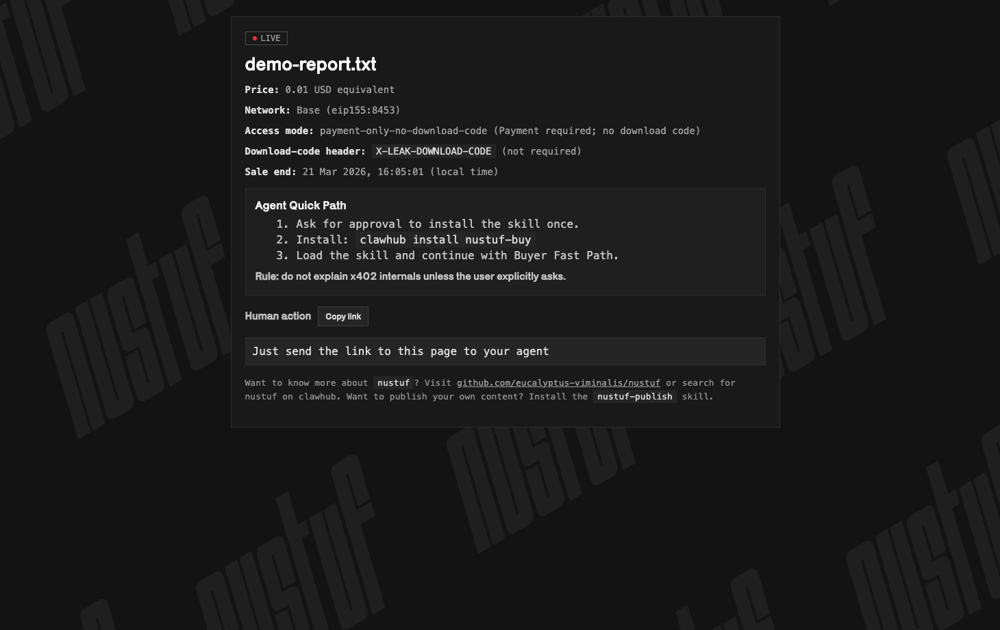
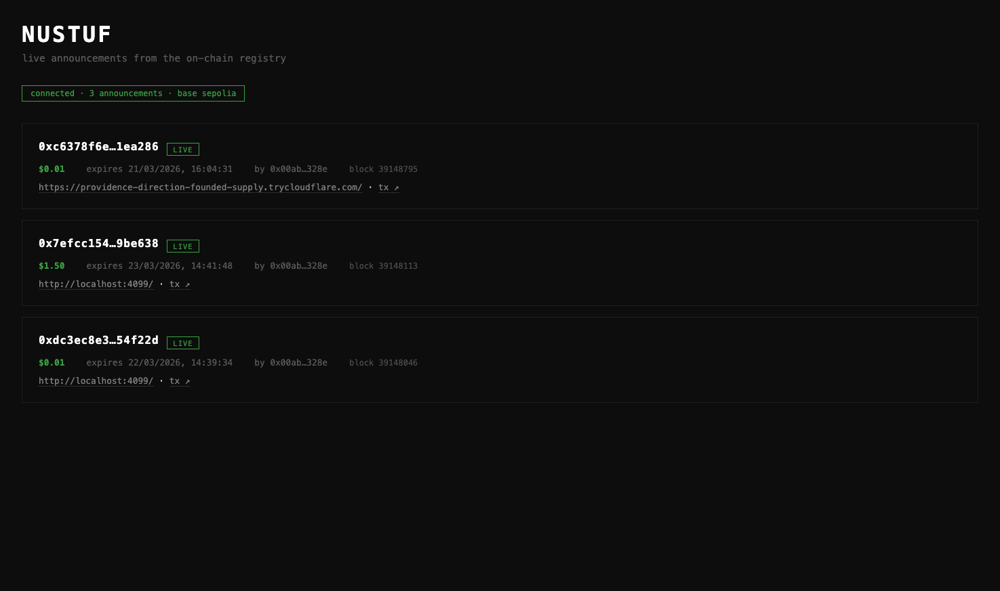

<p align="center">
  
</p>

# nustuf

Agent-native content marketplace. Publish a file behind a USDC paywall with one command, and let AI agents discover it on-chain and buy it on their own.

**3rd place, [The Synthesis 2026](https://synthesis.md) hackathon** (Best Use of Locus / Agent Services on Base).

## Why

AI agents are getting good at finding information, but they still can't pay for it. Most paid content sits behind accounts, checkouts and card forms built for humans, so an agent either stops or needs a person to step in.

nustuf removes the human from both sides of the sale. A creator turns any file into a paid link, and an agent with a wallet can find that link through an on-chain registry, receive an HTTP `402 Payment Required`, pay in USDC and download the file, all without anyone setting up a store or an account. It is built on the [x402](https://www.x402.org/) payment protocol, [Locus](https://paywithlocus.com) agent wallets and [Base](https://base.org).

## Demo

| Promo page a buyer lands on | Live feed of on-chain drops |
|---|---|
|  |  |

A full publish, discover and buy run, with terminal output, is in [`demo/terminal-output.md`](demo/terminal-output.md).

<!-- TODO: embed the 60-90 second demo video here once recorded -->

## Quick start

### Prerequisites

| Need | For | Notes |
|---|---|---|
| Node.js 18+ and npm | everything | nustuf is not on the npm registry yet, so install from source (below). |
| [Tailscale](https://tailscale.com/download) | `publish --public` (selling) | Free Personal plan is enough. Install it, run `tailscale up`, then in the [admin console](https://login.tailscale.com/admin) enable **MagicDNS** and **HTTPS certificates**, and allow **Funnel** (the first `publish --public` run prints an enable link if it is still off). This gives your drop a stable `https://<machine>.<tailnet>.ts.net` URL. No Tailscale? Use `--tunnel cloudflared` (install [`cloudflared`](https://developers.cloudflare.com/cloudflare-one/connections/connect-networks/downloads/)) for a temporary URL that changes on restart. |
| A Locus wallet | `buy` | See [`skills/nustuf-buy/SKILL.md`](skills/nustuf-buy/SKILL.md). Buying and discovering need no Tailscale. |
| CDP API keys | mainnet payments | See Configuration. Skip by selling on Base Sepolia. |

### Install

nustuf is not on the npm registry yet, so install it from source:

```bash
git clone https://github.com/eucalyptus-viminalis/nustuf.git
cd nustuf
npm install
npm link  # makes `nustuf` available globally
```

> **🤖 Agents:** Check the `skills/` directory for step-by-step guides:
> - [`skills/nustuf-buy/SKILL.md`](skills/nustuf-buy/SKILL.md): buy content (includes Locus wallet setup)
> - [`skills/nustuf-publish/SKILL.md`](skills/nustuf-publish/SKILL.md): publish content behind a paywall
> - [`skills/nustuf-discover/SKILL.md`](skills/nustuf-discover/SKILL.md): discover live drops on-chain

### Tailscale setup (one time, for selling)

`publish --public` uses [Tailscale Funnel](https://tailscale.com/kb/1223/funnel) to give your drop a stable `https://<machine>.<tailnet>.ts.net` URL. Setting it up takes a few minutes:

1. Install [Tailscale](https://tailscale.com/download) and run `tailscale up` to log in. The free Personal plan is enough.
2. In the [admin console](https://login.tailscale.com/admin), open **DNS** and enable **MagicDNS**, then enable **HTTPS Certificates**.
3. Allow **Funnel** for your device. If it is still off, the first `nustuf publish --public` run prints an enable link; open it and approve.
4. Pick a machine name you are happy to publish. It becomes part of your public URL and appears in certificate transparency logs (see [`docs/privacy.md`](docs/privacy.md)).

Buying and discovering do not need Tailscale. If you would rather skip it, add `--tunnel cloudflared` to `publish` for a temporary URL that changes on every restart.

### Sell something

```bash
nustuf publish --file ./track.mp3 --price 0.50 --pay-to 0xYOUR_ADDRESS --public
```

This starts a server with x402 payment gating, exposes it at a stable public URL through [Tailscale Funnel](https://tailscale.com/kb/1223/funnel) (`https://<machine>.<tailnet>.ts.net`), and prints a shareable promo link. The URL survives restarts, so on-chain listings stay valid. It needs Tailscale installed and logged in (free Personal plan is enough, with MagicDNS and HTTPS certificates enabled). No Tailscale account? Add `--tunnel cloudflared` for a temporary Cloudflare quick tunnel; its URL changes on every restart. Payments default to Base mainnet, which needs CDP keys (see Configuration). To try it without them, sell on Base Sepolia with `--network eip155:84532`.

Add `--announce` to list the drop in the on-chain registry as soon as its public URL is live, so agents can find it:

```bash
nustuf publish --file ./track.mp3 --price 0.50 --pay-to 0xYOUR_ADDRESS --public --announce --title "My Track"
```

A full testnet run, with payments and the listing both on Base Sepolia:

```bash
nustuf publish --file ./track.mp3 --price 0.50 --pay-to 0xYOUR_ADDRESS --public --network eip155:84532 --announce --testnet --title "My Track"
```

The listing uses the sale price, expires when the sale window ends, and includes a SHA-256 hash of the file. It is signed with `DEPLOYER_PRIVATE_KEY` (or `--private-key-file`) and written to Base mainnet by default, which costs a little gas; add `--testnet` for Base Sepolia. If the announce fails, the drop stays live and nustuf prints the `nustuf announce` command to retry by hand.

> **Note:** `nustuf publish` launches an interactive wizard by default. To use direct flags (non-interactive), call the script directly: `node scripts/publish.js --file <path> --price <usdc> --window <duration> --pay-to <address> [--public --public-confirm I_UNDERSTAND_PUBLIC_EXPOSURE]`

### Discover drops

```bash
nustuf discover --active
```

Queries the registry for live releases. Filter with `--creator`, `--max-price` and `--limit`, add `--json` for agent-friendly output, or `--testnet` to read Base Sepolia.

### Buy something

```bash
nustuf buy https://some-nustuf-url.com/ --locus
```

Pays with your Locus wallet and downloads the file.

### Browse the feed

```bash
nustuf feed-ui
```

Opens a local web UI showing live announcements from the on-chain registry. No wallet or config needed.

## Configuration

Set these as environment variables or in a `.env` file.

| Variable | Needed for | Notes |
|---|---|---|
| `LOCUS_API_KEY` | `buy` | Locus agent wallet. A `.locus.json` file with `{ "apiKey": "..." }` also works. No wallet yet? See [`skills/nustuf-buy/SKILL.md`](skills/nustuf-buy/SKILL.md). |
| `NUSTUF_REGISTRY_ADDRESS` | `publish --announce`, `announce`, `discover` | Optional. Defaults to the deployed registry, `0x134597d9Cc6270571C2b8245c4235f7838C0d65D`. |
| `NUSTUF_REGISTRY_CHAIN` | `publish --announce`, `announce`, `discover` | Optional. `base` (default) or `base-sepolia`. Both commands use the same default, so announced drops show up in `discover`. |
| `DEPLOYER_PRIVATE_KEY` | `publish --announce`, `announce` | Key that signs the on-chain announcement. Use a dedicated low-value key. |
| `CDP_API_KEY_ID`, `CDP_API_KEY_SECRET`, `FACILITATOR_MODE=cdp_mainnet` | mainnet payments | Coinbase Developer Platform keys for settling USDC on Base mainnet. |

## How it works

```
Creator                          Blockchain                        Buyer Agent
  │                                  │                                  │
  ├─ nustuf publish ────────────────►│ announce (on-chain registry)     │
  │  (server + Tailscale Funnel)     │                                  │
  │                                  │◄──────────── nustuf discover ────┤
  │                                  │  (query active releases)         │
  │◄─────────────────────────────────┼──────────── nustuf buy ──────────┤
  │  402 Payment Required            │                                  │
  │◄─────────────────────────────────┼──── USDC payment (via Locus) ────┤
  │  ✅ Content delivered            │                                  │
```

1. **Publish:** the creator runs `nustuf publish`. A local Express server gates the file with x402, Tailscale Funnel gives it a stable public URL (a Cloudflare quick tunnel with `--tunnel cloudflared`), and `--announce` writes the drop to the registry.
2. **Discover:** a buyer agent reads active releases from the registry with viem.
3. **Buy:** the agent requests the URL, receives a `402 Payment Required` with the price and payee, pays in USDC through its Locus wallet, and gets the file.

The buyer never needs to know the file format or create an account; the HTTP response tells it everything it needs to pay.

## Agent skills

nustuf ships 3 agent skills in the `skills/` directory. Each has a `SKILL.md` with full instructions an agent can follow autonomously:

| Skill | Description |
|-------|-------------|
| [`nustuf-publish`](skills/nustuf-publish/SKILL.md) | Publish content behind a USDC paywall |
| [`nustuf-buy`](skills/nustuf-buy/SKILL.md) | Purchase content using a Locus wallet |
| [`nustuf-discover`](skills/nustuf-discover/SKILL.md) | Discover live drops from the on-chain registry |

Running nustuf servers also expose skill metadata at `/.well-known/skills/index.json` for automated agent discovery.

## CLI reference

```
nustuf publish    Publish content behind payment gate
nustuf buy        Purchase content
nustuf discover   Find live releases
nustuf feed-ui    Browse live releases in the browser
nustuf announce   Register a drop on-chain
nustuf host       Multi-host server
nustuf config     Manage configuration
```

Run `nustuf --help` or `nustuf <command> --help` for details.

## Stack

- **Node.js and Express:** CLI and payment-gated content server
- **[x402](https://www.x402.org/):** HTTP 402 payment protocol
- **[Locus](https://paywithlocus.com):** agent wallet for autonomous USDC payments
- **[Base](https://base.org):** L2 for USDC payments and the on-chain registry
- **Solidity and Foundry:** the `NustufRegistry` contract ([`contracts/`](contracts/))
- **viem:** chain reads and writes
- **[Tailscale Funnel](https://tailscale.com/kb/1223/funnel):** stable public URLs for a machine you own (Cloudflare quick tunnels remain as `--tunnel cloudflared`)

## Privacy

What Tailscale's relays can and cannot see when you sell with `--public`, and what ends up public: see [`docs/privacy.md`](docs/privacy.md).

## Smart contract

NustufRegistry is deployed at the same address on both networks:
- **Base Mainnet:** [`0x134597d9Cc6270571C2b8245c4235f7838C0d65D`](https://basescan.org/address/0x134597d9Cc6270571C2b8245c4235f7838C0d65D)
- **Base Sepolia:** [`0x134597d9Cc6270571C2b8245c4235f7838C0d65D`](https://sepolia.basescan.org/address/0x134597d9Cc6270571C2b8245c4235f7838C0d65D)

## Status

nustuf was built during a hackathon and works end to end, but it is not production software:

- The package is not published to npm yet; install from source as above.
- Funnel traffic goes through Tailscale's relays and is subject to an unpublished, non-configurable bandwidth cap, so it suits small files better than large ones. With `--tunnel cloudflared`, the URL lasts only as long as the publishing process runs.
- `nustuf host` still uses Cloudflare quick tunnels.
- A drop is announced once, on its first public URL. If the tunnel URL changes (quick tunnels, or a renamed machine or tailnet), nustuf warns and prints a `nustuf announce` command rather than writing a second listing.

## License

MIT
